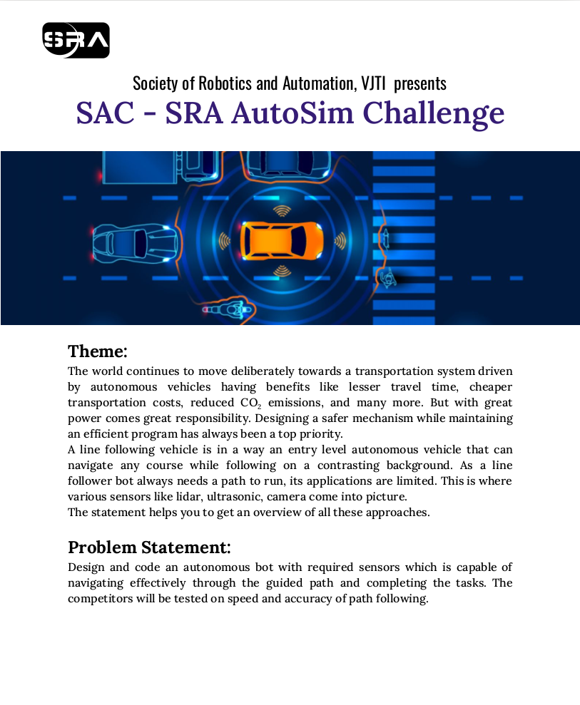
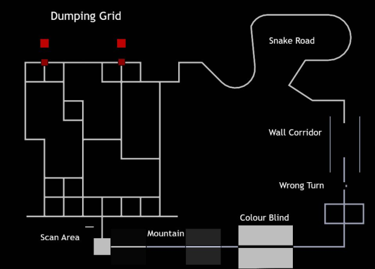

# SLAM_bot_Autosim_challenge
Team Mechatronix! A SRA competition 

  

 
This was the competition organized by SRA which involved making a urdf of the bot, integrating with the map provided and using line-following, wall-following and grid solving algorithm to complete the problem statement.

To check out the github link of the competition click [here](https://github.com/SRA-VJTI/SRA_Autosim_Challenge_v1.0)

## **Map for the competition** ------>

  

## Video 

  

